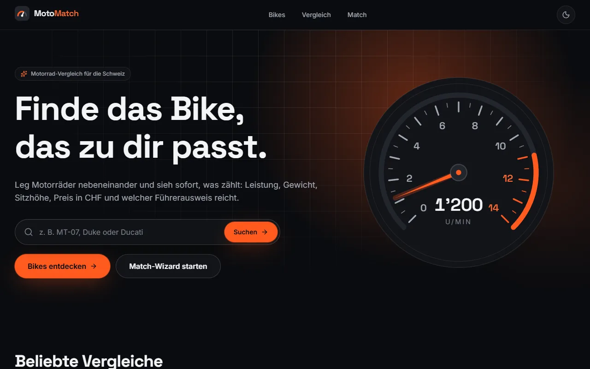
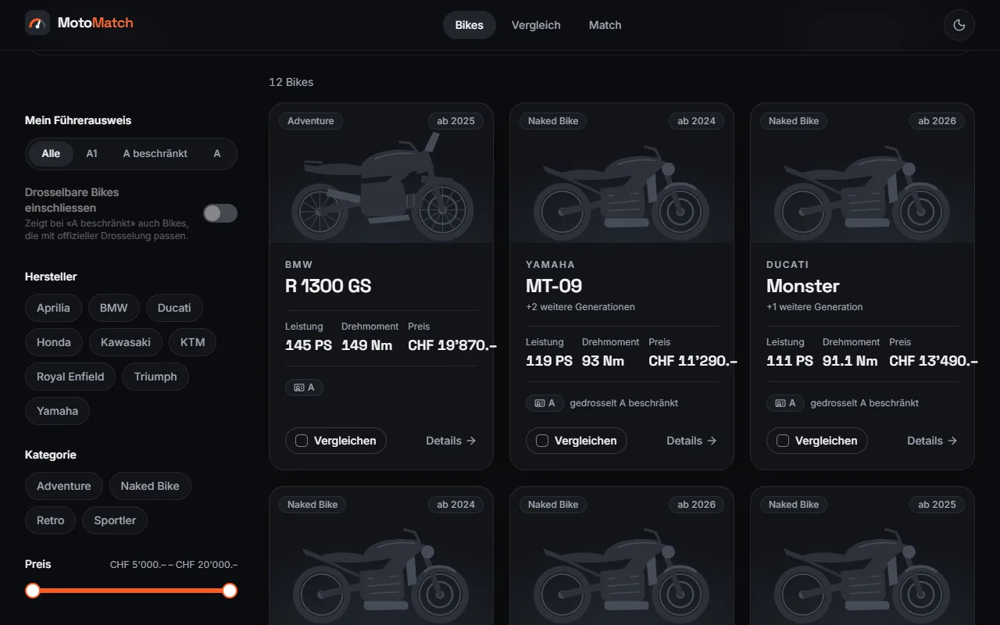
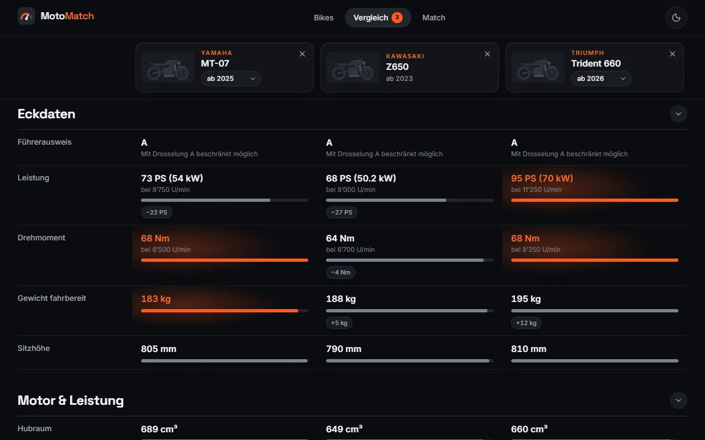
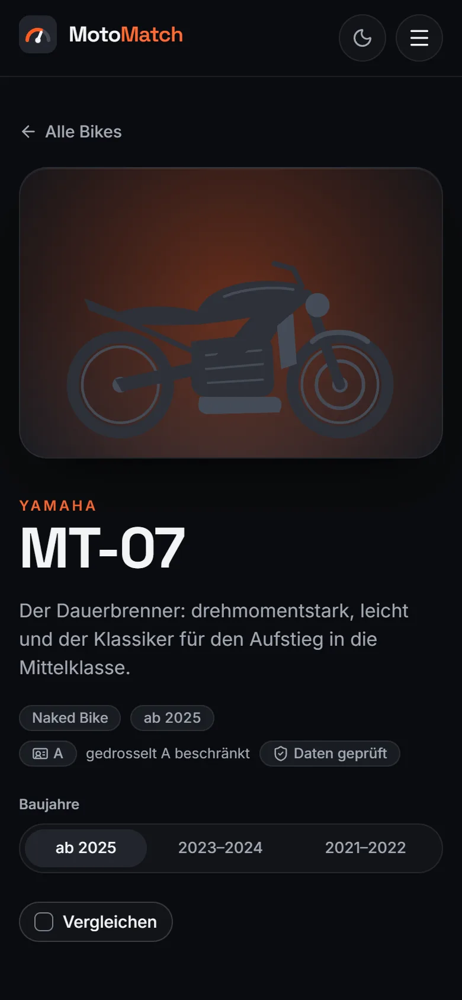
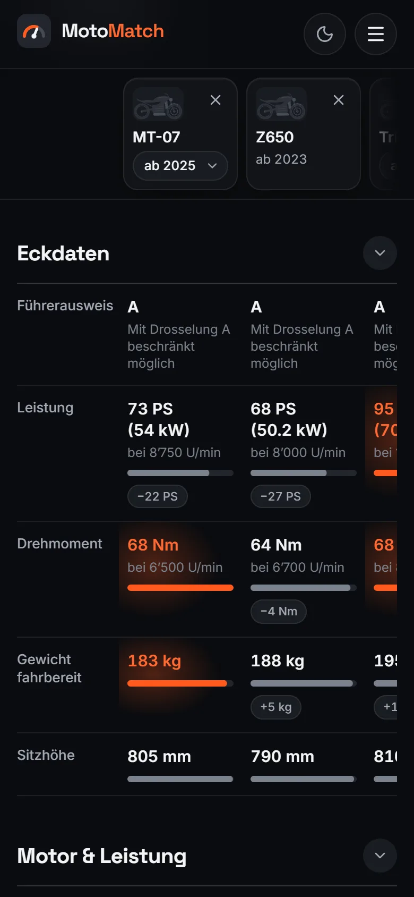
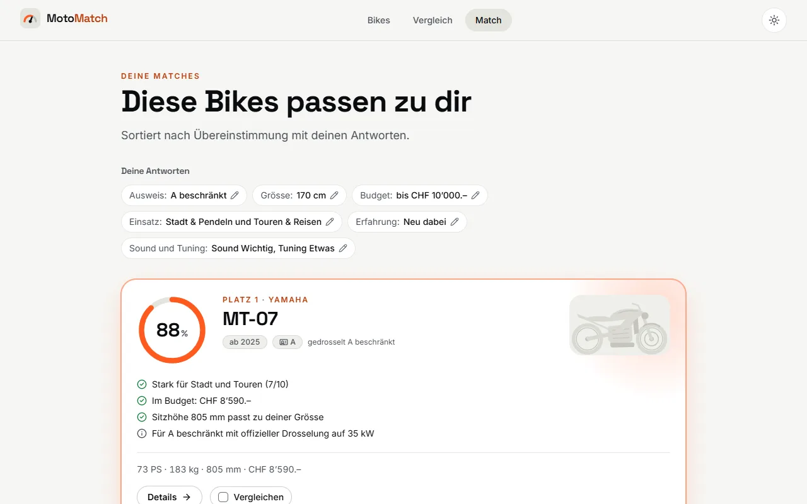

# MotoMatch

**Finde das Bike, das zu dir passt.** MotoMatch vergleicht Motorräder für den Schweizer Markt:
Leistung, Gewicht, Sitzhöhe, Preis in CHF, Führerausweis-Kategorie und Ausstattung auf einen Blick.
Ein Fragebogen schlägt passende Modelle vor.

> **Stand:** Phase 1 (Meilensteine M0–M6) ist fertig: eine reine Frontend-App mit Daten als
> JSON-Dateien. Als Nächstes folgt Phase 2 mit Supabase. Den genauen Stand hält
> [STATUS.md](STATUS.md) fest.

## Screenshots

| Startseite                                                                                                      | Katalog                                                                                                  |
| --------------------------------------------------------------------------------------------------------------- | -------------------------------------------------------------------------------------------------------- |
|  |  |

| Vergleich                                                                                             |
| ----------------------------------------------------------------------------------------------------- |
|  |

| Detailseite (Handy)                                                                | Vergleich (Handy)                                                                           | Match-Ergebnis (helles Design)                                                         |
| ---------------------------------------------------------------------------------- | ------------------------------------------------------------------------------------------- | -------------------------------------------------------------------------------------- |
|  |  |  |

Die Motorrad-Grafiken sind generische Silhouetten – keine Herstellerfotos, keine Logos.

## Funktionen

- **Katalog** – Suche, Sortierung und Filter (Hersteller, Kategorie, Preis, Leistung, Hubraum,
  Zylinder, drosselbar, Quickshifter, Blipper, Extras). Führerausweis-Filter A1 / A beschränkt / A,
  auf Wunsch inklusive drosselbarer Bikes. Alle Filter stehen in der URL.
- **Detailseite** – Generationen mit «Was ist neu?», Kerndaten mit hochzählenden Zahlen, technische
  Daten, Führerausweis-Info, Extras (nur was das Bike wirklich hat), Tuning- und Sound-Wertungen,
  Einsatzprofil als Radar, ähnliche Bikes und ganz unten das Video-Review.
- **Vergleich** – 2–3 Bikes nebeneinander, Generation pro Bike wählbar, Bestwert pro Zeile,
  Differenz-Chips wie «−22 PS», «Nur Unterschiede», Radar-Overlay und teilbarer Link. Bikes kommen
  über die Vergleichsleiste oder die Suche «Bike hinzufügen» (Strg K) dazu. Auf dem Handy lässt sich
  die Tabelle seitlich wischen.
- **Match-Wizard** – sechs Fragen (Führerausweis, Körpergrösse, Budget, Einsatz, Erfahrung, Sound und
  Tuning), danach 3–5 Bikes mit Match-Prozent und kurzer Begründung.
- **Gemacht für die Schweiz** – Preise im Format «CHF 12’490.–», Führerausweis-Kategorien nach
  Schweizer Recht, Texte in Schweizer Schreibweise.
- **Qualität** – dunkles und helles Design, Animationen mit Motion (bei «Bewegung reduzieren» nur
  Überblendungen), Barrierefreiheit automatisch mit axe-core geprüft (WCAG 2.2 AA), Lighthouse Mobile ≥ 90,
  YouTube-Videos werden erst nach einem Klick geladen.

## Schnellstart

Voraussetzung: [Node.js](https://nodejs.org/) 22.22 oder neuer (empfohlen: 24, siehe `.nvmrc`).

```bash
git clone https://github.com/rsfigo/MotoMatch.git
cd MotoMatch
npm install
npm run dev
```

Danach läuft die Seite auf <http://localhost:5173>.

## Skripte

| Befehl                  | Zweck                                                    |
| ----------------------- | -------------------------------------------------------- |
| `npm run dev`           | Entwicklungsserver mit Hot Reload                        |
| `npm run build`         | Typprüfung und Produktions-Build nach `dist/`            |
| `npm run preview`       | Produktions-Build lokal ansehen                          |
| `npm test`              | Unit-Tests (Vitest), `npm run test:watch` im Watch-Modus |
| `npm run validate:data` | Prüft alle Bike-Daten (JSON) mit Zod                     |
| `npm run lint`          | ESLint                                                   |
| `npm run typecheck`     | TypeScript-Prüfung ohne Build                            |
| `npm run format`        | Code mit Prettier formatieren (`format:check` prüft nur) |

## Tech-Stack

- **React 19** mit **TypeScript** (strict) und **Vite**
- **React Router** (deklarativ, ein Chunk pro Seite)
- **Tailwind CSS 4** mit Design-Tokens als CSS-Variablen (`src/styles/tokens.css`)
- **Motion** für Animationen, **lucide-react** für Icons, Gauges und Radar als eigenes SVG
- **Zod** zur Prüfung der Daten (nur beim Prüfen, nicht im Browser-Bundle)
- **Vitest** für die Logik, **ESLint** und **Prettier**
- Schriften **Inter** und **Space Grotesk**, selbst gehostet über Fontsource

## Projektstruktur

```
docs/screenshots/       Bilder für dieses README
public/                 favicon.svg, og-image.png (Vorschaubild beim Teilen)
scripts/                validate-data.ts (Datenprüfung), seoPlugin.ts (Sitemap, kanonische URLs)
src/
  app/                  App, Routen (pages.ts), Seitenübergänge
  pages/                eine Datei pro Seite (eigener Chunk)
  components/           ui, layout, bike, catalog, detail, compare, match, charts, home
  data/                 schema.ts (Zod), constants.ts, manufacturers.json, features.json, models/*.json
  hooks/                Daten-, URL- und UI-Hooks
  lib/                  reine Logik mit Tests (Führerausweis, Formatierung, Katalog, Vergleich, Match …)
  i18n/de.ts            alle Texte der Oberfläche
  styles/               Tailwind und Design-Tokens
```

Weitere Dokumente: [STATUS.md](STATUS.md) (aktueller Stand), [DECISIONS.md](DECISIONS.md)
(Entscheidungen und Annahmen), [CLAUDE.md](CLAUDE.md) (Hinweise für die Arbeit mit Claude).

## Daten

- Ein Modell pro Datei in `src/data/models/`, dazu Hersteller (`manufacturers.json`) und der Katalog
  der Extras (`features.json`). Die Struktur ist in `src/data/schema.ts` beschrieben.
- Ein Modell hat eine oder mehrere **Generationen** – alle Baujahre, in denen es technisch gleich ist.
- Jeder Wert stammt aus einer Quelle in `sources`. Unsichere Angaben fehlen lieber, oder die Generation
  trägt `"dataStatus": "needsVerification"`. Preise sind Schweizer Listenpreise mit Stand-Datum.
- Berechnet und nie gespeichert: PS aus kW, Leistungsgewicht, Reichweite und die
  Führerausweis-Kategorie (`src/lib/licence.ts`).
- Die Wertungen 1–10 (Tuning, Sound, Einsatzprofil) sind redaktionelle Einschätzungen; die Skalen
  stehen in [DECISIONS.md](DECISIONS.md).

## Neues Bike hinzufügen

1. **Recherchieren.** Am besten die Schweizer Herstellerseite oder das offizielle Datenblatt; dazu den
   Schweizer Listenpreis mit Datum. Magazinwerte (z. B. 0–100 km/h) sind als Test oder Schätzung zu
   kennzeichnen.
2. **Datei anlegen:** `src/data/models/<hersteller>-<modell>.json`, am einfachsten als Kopie einer
   bestehenden Datei (z. B. `yamaha-mt-125.json`). Der Dateiname muss der `id` entsprechen.
3. **Hersteller prüfen:** Fehlt er, in `src/data/manufacturers.json` ergänzen (`id`, `name`,
   `country` als Ländercode wie `"JP"`).
4. **Modell ausfüllen:** `id`, `manufacturerId`, `name` (ohne Hersteller, z. B. `"MT-07"`),
   `category` (`naked`, `sport`, `adventure`, `retro` …) und optional eine `tagline` (ein Satz).
5. **Generationen anlegen**, älteste zuerst. Die `id` ist `<modell-id>-<erstes Baujahr>`,
   `yearTo` ist `null`, solange das Modell gebaut wird. Eine neue Generation gibt es nur bei
   relevanten Änderungen – Motor, Leistung, Drehmoment, mehr als 3 kg Gewicht, Rahmen oder Fahrwerk,
   Elektronik, Quickshifter, Blipper, Extras, Drosselbarkeit oder Kategorie. Neue Farben oder Preise
   verlängern nur den Zeitraum.
6. **Pflichtfelder je Generation:** Motor (`powerKw` ist die Quelle der Wahrheit, PS werden
   berechnet), Fahrwerk (`weightKg` fahrbereit laut Hersteller, `seatHeightMm`, `tankL`, `gears`,
   `drive`), `throttle` (gedrosselte Leistung nur für offizielle Versionen), `quickshifter` und
   `blipper` (`standard`, `optional` oder `none`), `price` mit `asOf`, Wertungen, `tuningNote`,
   `sound.description`, `sources` (https-Links), `dataStatus` und `lastChecked`.
7. **Optionale Felder nur mit belegtem Wert:** Drehzahlen, Höchstgeschwindigkeit und 0–100 km/h (mit
   `kind`: `official`, `tested` oder `estimate`), Verbrauch, Standgeräusch, «Was ist neu?»
   (`changes`), Farben, Extras (Schlüssel aus `features.json`), YouTube-Link (nur bestätigte Links).
   Keine Fotos von Herstellern oder anderen Websites.
8. **Prüfen:** `npm run validate:data` nennt jeden Fehler mit Datei und Feld; danach `npm test` und
   im Browser `/bikes/<id>` ansehen.
9. **Unsicherheiten festhalten:** Wo Quellen sich widersprechen, `"dataStatus": "needsVerification"`
   setzen und den Grund in [DECISIONS.md](DECISIONS.md) notieren.

Ein neues Extra kommt in `src/data/features.json` (`key`, `label`, `group`, `icon`); erlaubte Icons
stehen in `src/data/constants.ts`.

## Veröffentlichen

`npm run build` erzeugt statische Dateien in `dist/`, die auf jedem Webhosting laufen.

- **Domain:** Mit der Umgebungsvariable `VITE_SITE_URL` (siehe [.env.example](.env.example)) ergänzt
  der Build kanonische URLs, das Vorschaubild für Open Graph und eine `sitemap.xml`.
- **Weiterleitung:** MotoMatch ist eine Single-Page-App. Der Server muss alle unbekannten Pfade auf
  `index.html` umleiten (z. B. Netlify `/*  /index.html  200`, nginx `try_files $uri /index.html;`).

## Hinweise

Alle Angaben ohne Gewähr. Marken gehören den jeweiligen Inhabern, MotoMatch steht in keiner Verbindung
zu den Herstellern. Impressum und Datenschutz sind Entwürfe und werden vor dem Livegang ergänzt.
